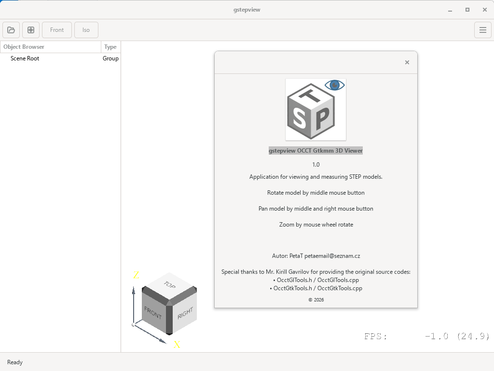

# gstepview is Gtkmm4 easy Application with Opencascade sample test step file viewer
This simplified sample C++ code which try show possible using gtkmm4  with integraton Opencascade this code is possible to build and run on Debian13 or on Windows in MSYS2 enviroment.

Building on Windows:
====================

1.) Install MSYS2
-----------------
Download and run the msys2 installer from http://msys2.github.io/ Tested only with the 64bit version. Make sure that the path you select for installation doesn’t contain any spaces.

2.) Start MSYS console
----------------------
Launch the Start Menu item “MSYS2 UCRT64” you should be greeted with a console window. All steps below refer to what you should type into that window.

3.) Install updates
-------------------
Type:

   pacman -Syu

if it tells you to close restart msys, close the console window and start it again. Then run pacman -Syu again.

4.) Install dependencies
------------------------
Type/paste

   pacman -S \\ \
mingw-w64-ucrt-x86_64-gcc \\ \
mingw-w64-ucrt-x86_64-pkgconf \\ \
mingw-w64-ucrt-x86_64-gtkmm-4.0 \\ \
mingw-w64-ucrt-x86_64-opencascade \\ \
mingw-w64-ucrt-x86_64-yaml-cpp \\ \
mingw-w64-ucrt-x86_64-librsvg \\ \
mingw-w64-ucrt-x86_64-libepoxy \\ \
git \\ \
zip \\ \
unzip \\ \
--needed

When prompted, just hit return. Sit back and wait for it to install what’s almost a complete linux environment.

Before continuing you may change to another directory. It easiest to type cd followed by a space and drop the folder you want to change to on the window.

5.) Clone gtkmm4-opencascade-sample-test by type/paste on commandline:
---------------------------------------------------------------------

   git clone https://github.com/Peta-T/gtkmm4-opencascade-sample-test \
   cd gtkmm4-opencascade-sample-test

6.) Build it - copy/paste on command line:
------------------------------------

    windres app_resource.rc -o app_resource.o

    g++ -std=c++17 -g main.cpp OcctGtkGLAreaViewer.cpp OcctGtkWindowSample.cpp OcctGlTools.cpp OcctGtkTools.cpp OcctInputBridge.cpp AdvancedMouseTracker.cpp app_resource.o -o gstepview.exe -mwindows $(pkg-config --cflags --libs gtkmm-4.0 epoxy yaml-cpp librsvg-2.0) -I./ -I/ucrt64/include/opencascade -I/ucrt64/include/opencascade/Standard -D_USE_MATH_DEFINES -lopengl32 -lgdi32 -lTKBinL -lTKBin -lTKBinTObj -lTKBinXCAF -lTKBool -lTKBO -lTKBRep -lTKCAF -lTKCDF -lTKDCAF -lTKDECascade -lTKDEGLTF -lTKDEIGES -lTKDEOBJ -lTKDEPLY -lTKDE -lTKDESTEP -lTKDESTL -lTKDEVRML -lTKDraw -lTKernel -lTKExpress -lTKFeat -lTKFillet -lTKG2d -lTKG3d -lTKGeomAlgo -lTKGeomBase -lTKHLR -lTKLCAF -lTKMath -lTKMesh -lTKMeshVS -lTKOffset -lTKOpenGl -lTKOpenGlTest -lTKPrim -lTKQADraw -lTKRWMesh -lTKService -lTKShHealing -lTKStdL -lTKStd -lTKTObjDRAW -lTKTObj -lTKTopAlgo -lTKTopTest -lTKV3d -lTKVCAF -lTKViewerTest -lTKXCAF -lTKXDEDRAW -lTKXMesh -lTKXmlL -lTKXml -lTKXmlTObj -lTKXmlXCAF -lTKXSBase -lTKXSDRAWDE -lTKXSDRAWGLTF -lTKXSDRAWIGES -lTKXSDRAWOBJ -lTKXSDRAWPLY -lTKXSDRAW -lTKXSDRAWSTEP -lTKXSDRAWSTL -lTKXSDRAWVRML

7.) Run app - type on command line:
-----------------------------------

   ./gstepview.exe

   if you want to instal as independent Windows application must add next files from c:\msys2\... to same folder:
avcodec-62.dll \
avformat-62.dll \
avutil-60.dll \
libaom.dll \
libbluray-3.dll \
libbrotlicommon.dll \
libbrotlidec.dll \
libbrotlienc.dll \
libbz2-1.dll \
libcairo-2.dll \
libcairo-gobject-2.dll \
libcairomm-1.16-1.dll \
libcairo-script-interpreter-2.dll \
libcrypto-3-x64.dll \
libdatrie-1.dll \
libdav1d-7.dll \
libdeflate.dll \
libepoxy-0.dll \
libexpat-1.dll \
libffi-8.dll \
libfontconfig-1.dll \
libfreeimage-3.dll \
libfreetype-6.dll \
libfribidi-0.dll \
libgcc_s_seh-1.dll \
libgdk_pixbuf-2.0-0.dll \
libgio-2.0-0.dll \
libgiomm-2.68-1.dll \
libglib-2.0-0.dll \
libglibmm-2.68-1.dll \
libgme.dll \
libgmodule-2.0-0.dll \
libgmp-10.dll \
libgnutls-30.dll \
libgobject-2.0-0.dll \
libgomp-1.dll \
libgraphene-1.0-0.dll \
libgraphite2.dll \
libgsm.dll \
libgstallocators-1.0-0.dll \
libgstaudio-1.0-0.dll \
libgstbase-1.0-0.dll \
libgstd3d12-1.0-0.dll \
libgstd3dshader-1.0-0.dll \
libgstgl-1.0-0.dll \
libgstpbutils-1.0-0.dll \
libgstplay-1.0-0.dll \
libgstreamer-1.0-0.dll \
libgsttag-1.0-0.dll \
libgstvideo-1.0-0.dll \
libgtk-4-1.dll \
libgtkmm-4.0-0.dll \
libharfbuzz-0.dll \
libharfbuzz-subset-0.dll \
libhogweed-6.dll \
libhwy.dll \
libiconv-2.dll \
libidn2-0.dll \
libIex-3_4.dll \
libIlmThread-3_4.dll \
libImath-3_2.dll \
libintl-8.dll \
libjbig-0.dll \
libjpeg-8.dll \
libjpegxr.dll \
libjxl.dll \
libjxl_cms.dll \
libjxl_threads.dll \
libjxrglue.dll \
liblc3-1.dll \
liblcms2-2.dll \
libLerc.dll \
liblzma-5.dll \
liblzo2-2.dll \
libmodplug-1.dll \
libmp3lame-0.dll \
libnettle-8.dll \
libogg-0.dll \
libopencore-amrnb-0.dll \
libopencore-amrwb-0.dll \
libOpenEXR-3_4.dll \
libOpenEXRCore-3_4.dll \
libopenjp2-7.dll \
libopenjph-0.26.dll \
libopenvr_api.dll \
libopus-0.dll \
liborc-0.4-0.dll \
libp11-kit-0.dll \
libpango-1.0-0.dll \
libpangocairo-1.0-0.dll \
libpangoft2-1.0-0.dll \
libpangomm-2.48-1.dll \
libpangowin32-1.0-0.dll \
libpcre2-8-0.dll \
libpixman-1-0.dll \
libpng16-16.dll \
librav1e.dll \
libraw-24.dll \
librsvg-2-2.dll \
librtmp-1.dll \
libshaderc_shared.dll \
libsharpyuv-0.dll \
libsigc-3.0-0.dll \
libsoxr.dll \
libspeex-1.dll \
libsrt.dll \
libssh.dll \
libstdc++-6.dll \
libSvtAv1Enc-4.dll \
libtasn1-6.dll \
libtbb12.dll \
libthai-0.dll \
libtheoradec-2.dll \
libtheoraenc-2.dll \
libtiff-6.dll \
libTKBO.dll \
libTKBRep.dll \
libTKCAF.dll \
libTKCDF.dll \
libTKDE.dll \
libTKDESTEP.dll \
libTKernel.dll \
libTKG2d.dll \
libTKG3d.dll \
libTKGeomAlgo.dll \
libTKGeomBase.dll \
libTKHLR.dll \
libTKLCAF.dll \
libTKMath.dll \
libTKMesh.dll \
libTKOpenGl.dll \
libTKPrim.dll \
libTKService.dll \
libTKShHealing.dll \
libTKTopAlgo.dll \
libTKV3d.dll \
libTKVCAF.dll \
libTKXCAF.dll \
libTKXSBase.dll \
libunistring-5.dll \
libva.dll \
libva_win32.dll \
libvorbis-0.dll \
libvorbisenc-2.dll \
libvpl-2.dll \
libvpx-1.dll \
libwebp-7.dll \
libwebpmux-3.dll \
libwinpthread-1.dll \
libx264-165.dll \
libx265-215.dll \
libxml2-16.dll \
libzstd.dll \
libzvbi-0.dll \
swresample-6.dll \
swscale-9.dll \
xvidcore.dll \
zlib1.dll \

Building on Debian 13:
====================

1.) Install dependencies
------------------------
Type/paste

   su  \
   apt update  \
   apt install \\ \
    build-essential \\ \
    libgtkmm-4.0-dev \\ \
    libocct-data-exchange-dev \\ \
    libocct-draw-dev \\ \
    libocct-foundation-dev \\ \
    libocct-modeling-algorithms-dev \\ \
    libocct-modeling-data-dev \\ \
    libocct-ocaf-dev \\ \
    libocct-visualization-dev \\ \
    libepoxy-dev \\ \
    libyaml-cpp-dev \\ \
    librsvg2-dev \\ \
    git \\ \
    libgl-dev \\ \ 
    libegl-dev \\ \
    pkg-config \

When prompted, just hit return. Sit back and wait for it to install what’s almost a complete linux environment.

Before continuing you may change to another directory. It easiest to type cd followed by a space and drop the folder you want to change to on the window.

2.) Clone gtkmm4-opencascade-sample-test by type/paste on commandline:
---------------------------------------------------------------------

   git clone https://github.com/Peta-T/gtkmm4-opencascade-sample-test \
   cd gtkmm4-opencascade-sample-test

3.) Build it - copy/paste on command line:
------------------------------------

    g++ -std=c++17 -g main.cpp OcctGtkGLAreaViewer.cpp OcctGtkWindowSample.cpp \
    OcctGlTools.cpp OcctGtkTools.cpp OcctInputBridge.cpp AdvancedMouseTracker.cpp \
    -o gstepview \
    $(pkg-config --cflags --libs gtkmm-4.0 epoxy yaml-cpp librsvg-2.0) \
    -I/usr/include/opencascade \
    -lTKBinL -lTKBin -lTKBinTObj -lTKBinXCAF -lTKBool -lTKBO -lTKBRep \
    -lTKCAF -lTKCDF -lTKDCAF -lTKDECascade -lTKDEGLTF -lTKDEIGES \
    -lTKDEOBJ -lTKDEPLY -lTKDE -lTKDESTEP -lTKDESTL -lTKDEVRML \
    -lTKDraw -lTKernel -lTKExpress -lTKFeat -lTKFillet -lTKG2d -lTKG3d \
    -lTKGeomAlgo -lTKGeomBase -lTKHLR -lTKLCAF -lTKMath -lTKMesh \
    -lTKMeshVS -lTKOffset -lTKOpenGl -lTKOpenGlTest -lTKPrim -lTKQADraw \
    -lTKRWMesh -lTKService -lTKShHealing -lTKStdL -lTKStd -lTKTObjDRAW \
    -lTKTObj -lTKTopAlgo -lTKTopTest -lTKV3d -lTKVCAF -lTKViewerTest \
    -lTKXCAF -lTKXDEDRAW -lTKXMesh -lTKXmlL -lTKXml -lTKXmlTObj \
    -lTKXmlXCAF -lTKXSBase -lTKXSDRAWDE -lTKXSDRAWGLTF -lTKXSDRAWIGES \
    -lTKXSDRAWOBJ -lTKXSDRAWPLY -lTKXSDRAW -lTKXSDRAWSTEP -lTKXSDRAWSTL -lTKXSDRAWVRML \
    -lGL -lEGL

4.) Run app - type on command line:
-----------------------------------

   ./gstepview

